# SDK Quiz Generator

A skill for generating test questions with standard answers from SDK documentation. Produces three question types: **Unit Test**, **Complex QA**, and **Trading Strategy**.

> 📖 For question types, examples, generation workflow, and best practices, see **[SKILL.md](SKILL.md)**

## Installation

Place the skill directory under your agent's skill path:

```bash
cp -r sdk-quiz-generator /path/to/skills/
```

Or clone directly:

```bash
git clone https://github.com/Lazarus893/sdk-quiz-generator.git /path/to/skills/sdk-quiz-generator
```

## Usage

### Generate Unit Test answers

```bash
export OPENAI_API_KEY="sk-..."

python3 scripts/generate_unit_test_answer.py \
  "What is SPY's largest country weighting?" \
  "https://data-gateway.prd.space.id/api/v1/etf/country-weightings" \
  symbol=SPY
```

### Generate Complex QA answers

```bash
# Single question (LLM)
export OPENAI_API_KEY="sk-..."
python3 scripts/generate_complex_qa_answer.py input.json

# Batch (LLM)
python3 scripts/generate_complex_qa_answer.py batch.json --batch

# Batch (programmatic, no LLM)
python3 scripts/generate_complex_qa_answer.py batch.json --batch --no-llm
```

See `references/PIPELINE.md` for input JSON format.

## Pipeline Architecture

```mermaid
graph LR
    subgraph Unit_Test["Unit Test Pipeline"]
        A1["User provides SDK doc"] --> A2["Generate question + query params"]
        A2 --> A3["Call SDK Gateway API"]
        A3 --> A4["GPT-5.2 generates answer"]
        A4 --> A5["Output JSON"]
    end

    subgraph Complex_QA["Complex QA Pipeline"]
        B1["User provides SDK docs"] --> B2["Generate question + MULTIPLE query params"]
        B2 --> B3["Generate solution steps"]
        B3 --> B4["Multiple SDK Gateway Calls (并行)"]
        B4 --> B5["GPT-5.2 / programmatic calculation"]
        B5 --> B6["Output JSON"]
    end

    style A1 fill:#e7f5ff,stroke:#1971c2
    style A2 fill:#e7f5ff,stroke:#1971c2
    style A3 fill:#e7f5ff,stroke:#1971c2
    style A4 fill:#e7f5ff,stroke:#1971c2
    style A5 fill:#c8e6c9,stroke:#1971c2
    style B1 fill:#fff4e1,stroke:#f76707
    style B2 fill:#fff4e1,stroke:#f76707
    style B3 fill:#fff4e1,stroke:#f76707
    style B4 fill:#ffe8cc,stroke:#f76707
    style B5 fill:#ffe8cc,stroke:#f76707
    style B6 fill:#c8e6c9,stroke:#f76707
```



### Key Differences

| Aspect | Unit Test | Complex QA |
|--------|-----------|------------|
| Queries per question | 1 | 1-N (multiple parallel) |
| Answer type | Direct lookup | Calculation required |
| Solution steps | Not needed | Required |

## Project Structure

```
sdk-quiz-generator/
├── SKILL.md                           # Skill definition (question types, workflow)
├── references/
│   ├── unit_test_examples.md          # Unit Test examples
│   ├── complex_qa_examples.md         # Complex QA examples
│   ├── PIPELINE.md                    # Pipeline architecture + JSON formats
│   └── GUIDELINES.md                  # Question generation guidelines
└── scripts/
    ├── generate_unit_test_answer.py   # Unit Test answer (LLM)
    ├── generate_complex_qa_answer.py  # Complex QA (single/batch, LLM/programmatic)
    └── sid_gateway_client.py          # Gateway client
```

## Environment Variables

| Variable | Required | Description |
|----------|----------|-------------|
| `OPENAI_API_KEY` | Optional | OpenAI API key (GPT-5.2). If not set, `answer` will be empty |
| `SID_API_KEY` | No (has default) | Gateway authentication key |

> 💡 **No API Key?** Scripts will still fetch SDK data and output `question`, `query_params`, `sdk_response` — just with `answer: ""`. You can then use any LLM to generate the answer from the returned data.
